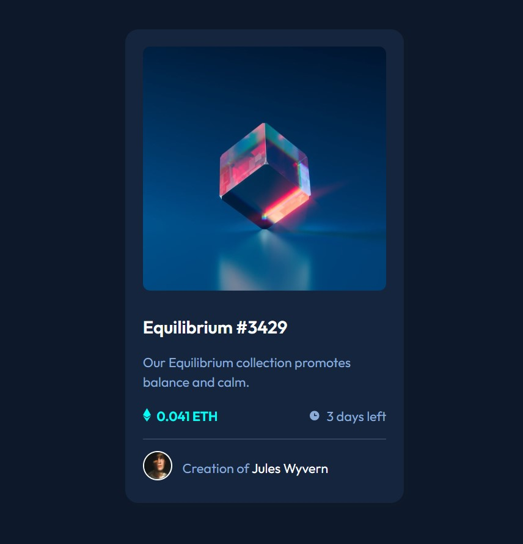

# Frontend Mentor - NFT preview card component solution

This is a solution to the [NFT preview card component challenge on Frontend Mentor](https://www.frontendmentor.io/challenges/nft-preview-card-component-SbdUL_w0U). Frontend Mentor challenges help you improve your coding skills by building realistic projects. 

## Table of contents

- [Overview](#overview)
  - [The challenge](#the-challenge)
  - [Screenshot](#screenshot)
  - [Links](#links)
- [My process](#my-process)
  - [Built with](#built-with)
  - [What I learned](#what-i-learned)
  - [Continued development](#continued-development)
  - [Useful resources](#useful-resources)
- [Author](#author)
- [Acknowledgments](#acknowledgments)


## Overview

### The challenge

Users should be able to:

- View the optimal layout depending on their device's screen size
- See hover states for interactive elements

### Screenshot




### Links

- Solution URL: [Add solution URL here](https://your-solution-url.com)
- Live Site URL: [Add live site URL here](https://qstar12-nft-preview.netlify.app/)

## My process

### Built with

- Semantic HTML5 markup
- CSS custom properties
- Flexbox
- [Styled Components](https://styled-components.com/) - For styles


### What I learned

Im proud to highlight this snippet. Prior to completing this challege I wasn't too familiar with the translate function. In this challenge I was ask to create a hover state for the image. This is only a snippet of how I worked through the process. In the end I learned about the translate function and the card is functional.
```scss
.middle {
  transition: .5s ease;
  opacity: 0;
  position: absolute;
  top: 50%;
  left: 50%;
  transform: translate(-50%, -50%);
  -ms-transform: translate(-50%, -50%);
  text-align: center;
  color: hsl(178, 100%, 50%);
}
```

### Continued development

In furture projects I want to become more proficient in the utilization of sass stylesheets. As I feel that they give the most flexibility for customization. I also would like to grow in formating my code. I think that structure is huge and I'd prefer that my code would be easy to analyze interpret and implement. Lastly, I would like to try anout card challege and utilize the grid. In this challenge I wanted to force myself to not use the grid as a learning technique. However I think that the grid is beneficial if I am ever in a situation where I have to develop additional cards. 

### Useful resources

- [Example resource 1](https://www.w3schools.com/howto/howto/css/image/ovelay.asp) - This is an amazing article which helped me finally understand the translate function. I'd recommend it to anyone still learning this concept.


## Author

- Website - [Amario Jones](https://www.your-site.com)
- Frontend Mentor - [@Qstar12](https://www.frontendmentor.io/profile/Qstar12)
- Twitter - [@yourusername](https://www.twitter.com/jones_amario)


## Acknowledgments

Thanks Frontend Mentor for making this possible. I look forward to more challeges.


